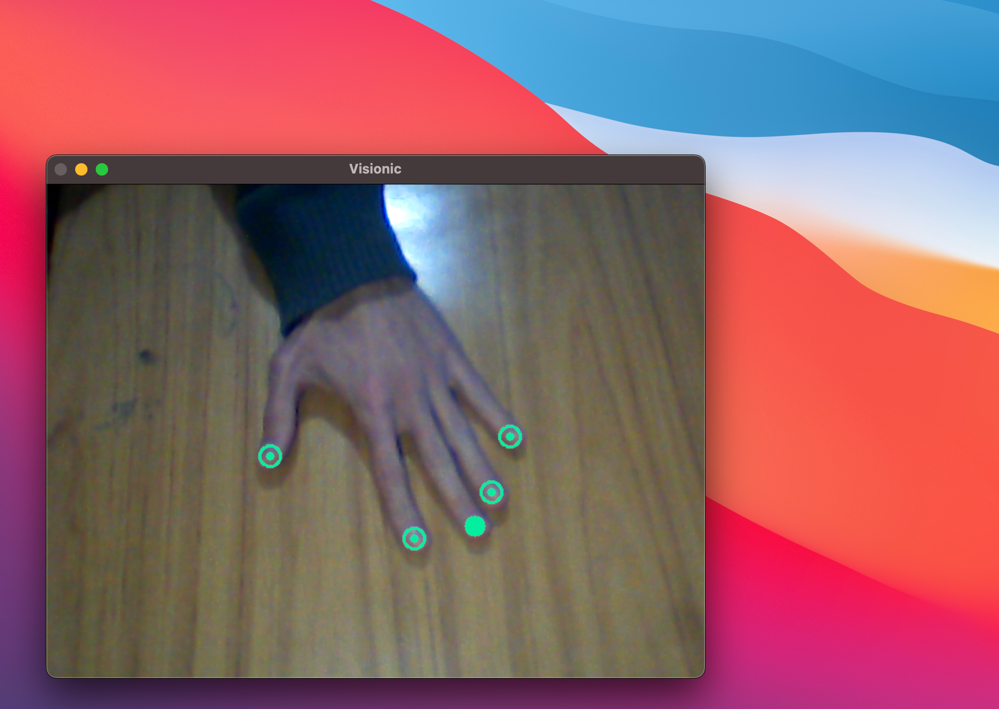

# Lo básico

<figure><figcaption></figcaption></figure>

**Visionic** es una aplicación de escritorio que permite controlar el cursor del mouse mediante gestos de la mano capturados por una cámara, transformando los movimientos naturales de las manos en un control preciso del ratón. Construido con técnicas modernas de visión por ordenador y aprendizaje automático, Visionic proporciona una forma nueva y accesible de interactuar con el ordenador.

### Características

* 🖱Reconocimiento preciso de gestos de mano para el control del mouse
* 🎯 Movimiento suave del cursor utilizando seguimiento de mano
* 🎵 Detección sonora configurable para gestos
* 📷 Compatibilidad con cámaras web externas e internas
* 🔴 Visualización en tiempo real de la cámara
* 🛠️ Configuración a través de una interfaz gráfica de usuario fácil de usar

### Limitaciones

Por el momento se presentan las siguientes limitaciones:

* La detección de gestos está configurada para ser usada con la mano izquierda. De ser usada con la otra mano el modelo reconocerá la mano, pero no procederá a reconocer exitosamente los gesto previos configurados.
* Del mismo modo la detección exitosa de los gestos, funcionará si el usuario cuenta con todos los dedos de su mano.

### Configuraciones

Hasta el momento Visionic soporta las siguientes configuraciones:

.png>)

**Activar sonido:** dejar activado si se quiere que al detectar un gesto se aplique un sonido como retroalimentación.

**Mostrar captura:** dejar activado si desea visualizar como la cámara detecta su mano en tiempo real.

**Cámara:** seleccionar entre dos tipos de cámara que tenga disponible para la detección:

* 0 : cámara externa conectada a su computadora.
* 1  : cámara interna disponible en su computadora. &#x20;

**Suavidad:** reacción de el cursor en relación con el desplazamiento de la detección.&#x20;

**Amplificar:** amplifica el área de desplazamiento del cursor para mejorar la amplitud o alcance disponible.

### Desplazamiento

Para el movimiento del cursor se hace uso de el dedo mayor de la mano izquierda, notara que una vez que la cámara web capture su mano, la punta de este dedo de la mano tiene un circulo relleno completo a diferencia del resto.

La velocidad de reacción o sensibilidad y la amplitud de desplazamiento puede configurarse como vimos, mientras que la precisión se ajusta automáticamente dependiendo de la velocidad de desplazamiento de la mano.

### Gestos

Para realizar las distintas acciones correspondientes que se realizan con un ratón(click izq, click der, scroll), se hacen uso de los siguientes gestos:

**Click Izquierdo:** levantar lentamente el dedo índice.

**Click Derecho:** estirar el dedo pulgar hacia abajo.

**Scroll:** encoger los cuatro dedos excepto el pulgar y arrastrar hacia adentro.

### Uso del software

Una vez que se encuentre instalado el software su uso es muy sencillo, asegurarse de tener conectado o disponer de alguna cámara web. En el caso de disponer de una cámara web externa conectada, asegurarse de que apunte a su mano izquierda desde arriba, para que de este modo el software pueda capturar la mano y proceder a detectar los gestos.


Quiere saber como instalar Visionic en su ordenador? Dirígete a la sección [Inicio rápido](inicio-rapido.md) para obtener mas información.

